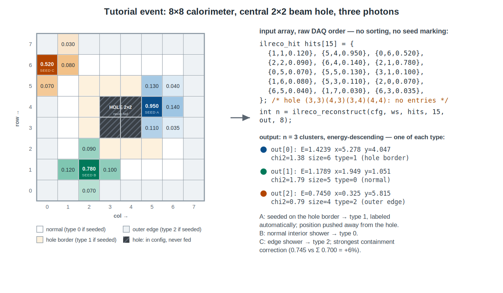

# ilreco


*Physics benchmark: energy resolution obtained with ilreco on a Geant4-simulated
10x10 PbWO4 array (2.055x2.055x20 cm crystals, measurement-matched response
model), electrons at 1-20 GeV — reproducing the HallD measured PbWO4 model
(dashed). Produced by the simulation-reconstruction regression that gates every
change to this library.*

Island-clustering reconstruction for square-cell calorimeters (PbWO4 / lead
glass): connected-region search, peak finding, measured-shower-profile energy
sharing between overlapping showers, χ²-refined positions and containment-
corrected energies. Plain C11, zero dependencies, thread-safe, allocation-free
per event; C++ RAII wrapper and Python binding included. Originally written by
Ilya Larin (HyCal/PrimEx lineage).

**Documentation:** <https://emcal.github.io/ilreco/> — install (pip / plain C /
CMake), tutorial, threading and memory model, Python API, shower profiles.

## Quick start

```c
#include <ilreco.h>

char err[256];
/* once per process: geometry + shower-profile tables, immutable afterwards */
ilreco_config *cfg = ilreco_config_create(/*n_cols=*/30, /*n_rows=*/30,
                                          "data/prof_pwo.dat", err, sizeof err);
if (!cfg) { fprintf(stderr, "%s\n", err); return 1; }

/* once per thread: all working memory, one allocation */
ilreco_workspace *ws = ilreco_workspace_create(cfg);

/* per event: zero allocations */
ilreco_hit hits[] = { {12, 14, 1.85}, {13, 14, 0.42}, {12, 15, 0.31} };  /* 0-based col,row; GeV */
ilreco_cluster out[16];
int n = ilreco_reconstruct(ws, hits, 3, out, 16);
for (int i = 0; i < n && i < 16; ++i)
    printf("E=%.3f GeV at (%.2f, %.2f) cells, chi2=%.2f\n",
           out[i].e, out[i].x, out[i].y, out[i].chi2);

ilreco_workspace_destroy(ws);
ilreco_config_destroy(cfg);
```

Or from Python (`pip install ilreco`):

```python
import ilreco
calo = ilreco.Calorimeter(30, 30, profile="pwo")
clusters = calo.reconstruct(hits_table)   # numpy table in, numpy table out
```

Build:

```bash
cmake -B build && cmake --build build -j     # library + test suite
cd build && ctest                            # unit / smoke / golden-data / benchmark
```

## Tutorial: an 8×8 calorimeter with a central 2×2 beam hole

Step-by-step example. The detector: an 8×8 crystal array with the central
2×2 block removed for the beam (the classic layout). The event: three photons,
landing on a hole-border cell, a normal interior cell, and an outer-edge
cell — every cell class appears, each with its own cluster in the output.



### Step 1 — create the config (once per process)

```c
char err[256];
ilreco_config *cfg = ilreco_config_create(/*n_cols=*/8, /*n_rows=*/8,
                                          "data/prof_pwo.dat", err, sizeof err);
if (!cfg) { fprintf(stderr, "%s\n", err); return 1; }
```

The config holds the geometry and the shower-profile tables; after this call
it is immutable and shared by every thread. No hole registration happens here —
see step 2.

### Step 2 — which cells are normal, edge, hole border, hole

You do **not** register any of this explicitly:

- **Normal (interior) cells** — the 20 white cells: a cluster seeded there is
  labeled `type = 0`.
- **Outer edge** — the boundary ring (col 0/7, row 0/7): no phantom neighbors
  are assumed beyond it; a cluster *seeded* there gets `type = 2`.
- **Hole border** — the 12 cells surrounding the central 2×2: seeds there get
  **`type = 1`**, automatically. The built-in classification encodes this
  layout (a central 2×2 hole), so for this detector you leave it on.
  For a hole of any *other* shape or position, the built-in labels will not
  match — disable them with `ilreco_config_set_hole_classification(cfg, 0)`
  and track hole adjacency in your analysis (labels only; energies and
  positions are never affected by classification).
- **The hole is four cells you never feed.** (3,3), (4,3),
  (3,4), (4,4) exist in the geometry but no hit ever arrives for them, so
  clustering treats them as silent (zero-signal) neighbors — like dead
  channels. Energy deposited there is physically lost; the profile-based
  containment correction compensates on average, the same mechanism as at the
  outer edge.

### Step 3 — create a workspace (once per thread)

```c
ilreco_workspace *ws = ilreco_workspace_create(cfg);
```

One allocation, sized for the 8×8, reused for every event this thread
processes. The workspace remembers which config it belongs to, so from here
on every call takes only `ws` — with several calorimeters in one program
there is no way to pair a workspace with the wrong config. One workspace per
thread, never shared (see the multithreading section).

### Step 4 — put the event into the input array

Each fired cell becomes one `{col, row, energy}` entry — 0-based indices, GeV,
**no entries for the hole**. The array goes in **raw DAQ order**: you do not
sort it and you do not mark seeds — the library orders hits internally and
finds peak (seed) cells itself:

```c
ilreco_hit hits[15] = {
    {1, 1, 0.120}, {5, 4, 0.950}, {0, 6, 0.520},
    {2, 2, 0.090}, {6, 4, 0.140}, {2, 1, 0.780},
    {0, 5, 0.070}, {5, 5, 0.130}, {3, 1, 0.100},
    {1, 6, 0.080}, {5, 3, 0.110}, {2, 0, 0.070},
    {6, 5, 0.040}, {1, 7, 0.030}, {6, 3, 0.035},
};   /* hole cells (3,3) (4,3) (3,4) (4,4): no entries */

ilreco_cluster out[8];
int n = ilreco_reconstruct(ws, hits, 15, out, 8);
```

(The picture draws row 0 at the bottom; that is a drawing convention — ilreco
only sees indices, and the row↔physical-y mapping is yours.)

### Step 5 — interpret the output

Running the above gives `n = 3`; clusters arrive energy-descending,
and this event yields one of each type:

| | `e` [GeV] | `x`, `y` [cells] | `chi2` | `size` | `type` | interpretation |
|---|---|---|---|---|---|---|
| `out[0]` (A, blue) | **1.4239** | 5.278, 4.047 | 1.38 | 6 | **1** | seeded on the **hole border** — labeled automatically; E above the 1.405 GeV input sum (containment correction includes what leaked into the silent hole); position pushed away from the hole (right of seed col 5) |
| `out[1]` (B, green) | **1.1789** | 1.949, 1.051 | 1.79 | 5 | **0** | **normal** interior shower |
| `out[2]` (C, orange) | **0.7450** | 0.325, 5.815 | 0.79 | 4 | **2** | seeded on the **outer edge**; strongest correction (0.745 vs Σ 0.700 = +6%) — part of the shower left the detector |

Convert to millimeters for an array centered on the origin with pitch `p`:
`x_mm = (x - (n_cols-1)/2.0) * p` → photon A: `(5.278 - 3.5) * 20.9 = +37.2 mm`.

### Step 6 — multiple clusters and merged showers

The return value `n` is the number of clusters found (it can exceed `max_out`;
`out[]` receives at most `max_out`, highest energies first). Always loop:

```c
for (int i = 0; i < n && i < 8; ++i) { /* ... out[i] ... */ }
```

What `n` means physically — three regimes, on the same 8×8:

1. **Well-separated showers** (≥1 empty cell between them, like the tutorial
   event): distinct islands → one clean cluster each, nothing shared.
2. **Touching showers with distinct maxima** (seeds two cells apart, 1.0 and
   0.9 GeV with a 0.3 GeV valley): ONE island, but peak finding sees two
   local maxima and profile-fits both:
   `n = 2`, `E = 1.453 / 1.303`, `x = 1.012 / 2.957` — and **both report
   `size = 7`**: every cell of the island belongs to both clusters, its
   energy *shared* between them according to the shower profile. Cluster
   sizes do not add up to the hit count in this regime.
3. **Genuinely merged** (maxima on adjacent cells, 1.00 and 0.95 GeV side by
   side): one maximum survives → `n = 1`, `E = 2.402` (the pair summed), and
   **`chi2 = 10.5`** against ~0.5–2 for a clean single shower. A one-cell
   separation is below the method's resolving power; cut on `chi2` to flag
   such candidates.

Note: `size` caps at 100 cells per cluster (`_MAXLEN_`), and cluster counting
saturates at the configured maximum (~200/event) — both far above physical
occupancies for these detectors.

## Conventions

- **0-based** `(col, row)` cell indices; `col` in `0..n_cols-1`, `row` in `0..n_rows-1`.
- Energies in **GeV**.
- Output positions in **cell units**: `x == col` means the center of that column;
  convert to length with your cell pitch: `x_mm = (x - (n_cols-1)/2.0) * pitch_mm`
  for an array centered on the origin.
- Clusters are returned **energy-descending**; the return value is the total
  found (may exceed `max_out`).
- `cluster.type`: 0 = interior, 2 = outer-ring cell seeded, 1 = central
  beam-hole region (disable with
  `ilreco_config_set_hole_classification(cfg, 0)` if your detector has no hole).

## Multithreading

**One shared `const` config, one workspace per thread.**

```c
ilreco_config *cfg = ilreco_config_create(...);   /* main thread, once */

/* in each worker thread: */
ilreco_workspace *ws = ilreco_workspace_create(cfg);
for (;;) { /* ... ilreco_reconstruct(ws, ...) on this thread's events ... */ }
ilreco_workspace_destroy(ws);
```

- The config is immutable after creation — any number of threads may read it
  concurrently, no locking needed. Call the `ilreco_config_set_*` tuners
  *before* the first workspace is created, never after. The config must
  outlive every workspace created from it.
- A workspace must never be used by two threads at once (it is the event
  scratch memory). One per thread, created once, reused for every event —
  do NOT create/destroy per event.
- Verified by the test suite: 4 threads × 200 events reproduce the serial
  results **bitwise** (`tests/unit/test_context_api.cpp`, tag `[threads]`).

## Arbitrary shapes: the cell-existence mask

Any detector that is a **subset of a rectangular grid** — a circular
calorimeter, an asymmetric beam-pipe hole (e.g. the EIC B0 EMCal) — is
supported via the cell-existence mask. Take the bounding box of your crystal
layout, mark which cells physically exist, and reconstruct as usual:

```c
/* EIC-B0-style: circular-ish array with an off-center beam-pipe hole */
ilreco_config *cfg = ilreco_config_create(15, 15, "data/prof_pwo.dat",
                                          err, sizeof err);
unsigned char mask[15 * 15];
for (int r = 0; r < 15; ++r)
    for (int c = 0; c < 15; ++c)
        mask[r * 15 + c] = crystal_exists_in_drawing(c, r);   /* your layout */
ilreco_config_set_cell_mask(cfg, mask);
```

What the mask changes:

- **Physics**: missing cells are excluded from the zero-signal neighbor
  treatment. Energy that leaks into a hole or past the rim is treated as
  *lost* (corrected up by the containment correction), not as "measured zero";
  chi2 stops counting nonexistent cells as measurements. Without a mask, a
  cluster hugging a hole is slightly under-corrected.
- **Labels**: `type` is derived from the mask — `1` = seed has a missing
  in-grid neighbor (hole border or rim), `2` = seed on the bounding-box ring,
  `0` = fully surrounded. The built-in central-hole pattern is ignored when a
  mask is set.
- **Validation**: hits on masked-out cells are rejected (`-1`) — feeding a
  nonexistent cell is a caller bug, not an event.

The no-mask behavior is bit-identical to the historical library (enforced by
the golden tables), so masks are purely opt-in.

## The shower profile ("weights") file

The `.dat` file passed to `ilreco_config_create` is the **transverse shower
profile** of your calorimeter. Energy sharing between overlapping showers,
the containment correction, and the chi2 position fit are all computed
against it.

**What it contains.** For a shower axis at transverse offset `(dx, dy)` from a
cell center (in **cell units**), the table gives the *mean fraction* of the
shower's energy deposited in that cell, and the *variance* of that fraction
(used in the chi2 denominator). `prof_pwo.dat` says: a centered shower puts
79.3% of its energy in its own 2.05 cm PbWO4 cell, 3.3% in each side neighbor,
1.1% in a diagonal one.

**File format** (text, one line per node):

```
i  j  amean  ad2c
```

- `i, j` = 100 × |dx|, 100 × |dy| — offsets in units of 0.01 cell, from 0 to
  500 (i.e. up to 5.00 cells); only the triangle `j <= i` is stored, the
  symmetric part is mirrored on load; the library bilinear-interpolates
  between nodes. 125,751 lines total.
- `amean` = mean energy fraction in the cell at that offset.
- `ad2c` = variance of that fraction (drives `sigma2` in the chi2).

**When to generate your own.** The offsets are in *cell units*, so the
table encodes the ratio of cell size to the Moliere radius, the material, and
the longitudinal averaging of the setup it was made for. Regenerate when any
of these changes:

- different **cell size / pitch** relative to the Moliere radius (the shipped
  `prof_pwo.dat` is for 2.05 cm PbWO4 cells, `prof_lg.dat` for lead
  glass) — even the same material with a different crystal width needs a new
  table;
- different **material** (X0, R_M);
- significantly different **incidence geometry** (large angles, very different
  target distance, thick upstream material);
- a response chain that reshapes the *measured* lateral profile (e.g. strong
  light-collection nonuniformity) — the table should describe reconstructed
  cell energies, not bare deposits.

Symptoms of a wrong profile: energy resolution far off expectations, biased
positions with a strong S-shape, chi2 values inflated for perfectly clean
single showers.

**How to generate one.** Monte-Carlo recipe (data-driven works the same way if
you can select clean single showers with known impact):

1. Simulate single electrons/photons over your energy range, impact points
   uniform across one cell, normal incidence (or your real geometry); apply
   your full response chain to get per-cell *measured* energies.
2. For every event and every cell within 5 cells of the true impact, compute
   the offset `(|dx|, |dy|)` in cell units and the cell's fraction of the
   event's total measured energy.
3. Accumulate mean and variance of the fraction in 0.01-cell offset bins;
   symmetrize (the table assumes |dx|,|dy| symmetry), smooth thin bins.
4. Write the `j <= i` triangle in the format above.

A working generator (built on the Geant4 simulation used for this library's
own validation) is maintained with the simulation package:
`scripts/770_generate_profile.py` — it also overlays the generated table
against the shipped one as a sanity check.

## Pitfalls

1. **~10 MeV cluster-seed threshold.** A cluster is only reconstructed if one
   cell exceeds `min_seed` (default 0.01 GeV, historically hardcoded), scaled up
   by `7·log(1+E_cluster)` for ≥3-cell clusters. Isolated deposits below it
   vanish silently. Tune with `ilreco_config_set_seed_threshold()`.
2. **Apply your own hit threshold upstream.** The library clusters whatever you
   feed it — there is no built-in per-hit energy cut.
3. **Merge duplicate cells upstream.** Feeding the same `(col,row)` twice is
   undefined (survives, but the output is unspecified).
4. **Two-gamma mass cut depends on geometry.** The second-shower acceptance
   uses the target–calorimeter distance (default 732 cm, PrimEx): set yours
   with `ilreco_config_set_zcal()`. (Note: the *sub-peak* second-order
   splitting is currently a dead stub — only distinct peaks are separated;
   see `tests/KNOWN_ISSUES.md`.)
5. **Energies come back containment-corrected** (profile-based, clamped to
   [raw, raw/0.8]) — do not apply your own leakage correction on top blindly.
6. **Edge showers are handled but physically lossy**: cells outside the grid
   are treated as nonexistent (correct for a real detector edge), so energies
   near edges lean on the correction of pitfall 5.
7. **The profile file must match your detector** — cell size (in Moliere
   radii), material, geometry. See "The shower profile (weights) file" above;
   using `prof_pwo.dat` for anything other than ~2 cm PbWO4 cells silently
   degrades energies, positions and chi2.
8. Dense events (hundreds of connected cells) are ~100× slower than single
   showers (~39 µs vs ~3.8 ms on a 2020s CPU; see `tests/benchmark/baseline.json`).
   Budget accordingly or pre-split regions upstream.

## Testing & validation

See `tests/README.md`: contract unit tests, smoke sweeps, golden event-by-event
regression tables frozen from Geant4-simulated detector data, speed benchmark
with a committed baseline, CI (build+ctest, sanitizers, static analysis), plus
an end-to-end simulation→reconstruction physics regression maintained with the
simulation package. Known quirks and their history: `tests/KNOWN_ISSUES.md`.
Every restructuring of this library is validated by byte-identical
reconstruction of the golden tables and of 33 simulated datasets.
