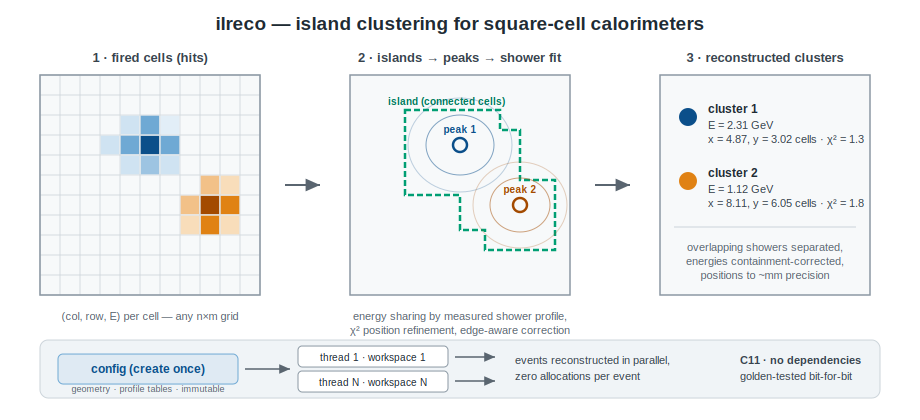
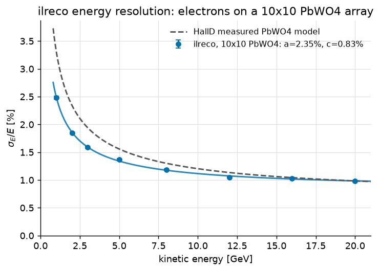

# ilreco

Island-clustering reconstruction for square-cell calorimeters (PbWO4, lead
glass): connected-region search, peak finding, measured-shower-profile energy
sharing between overlapping showers, χ²-refined positions and
containment-corrected energies. Plain C11 with zero dependencies, a C++ RAII
wrapper, and a Python binding — thread-safe, allocation-free per event.

*Energy resolution obtained with ilreco on a Geant4-simulated 10×10 PbWO4
array, electrons at 1–20 GeV, reproducing the HallD measured PbWO4 model
(dashed). This simulation→reconstruction regression gates every change to
the library.*

## History

The algorithm was written by Ilya Larin for the PrimEx experiment's HyCal
calorimeter (PbWO4 core, lead-glass ring) and has been used across
generations of JLab electromagnetic calorimetry since. In 2026 the library
was modernized without touching the physics: all state moved into explicit
contexts (an immutable shared configuration and per-thread workspaces),
indexing became 0-based, geometry became runtime configuration, and a
cell-existence mask added support for circular calorimeters and asymmetric
beam holes (e.g. the EIC B0 EMCal). Every step of that modernization was
validated bit-for-bit against frozen golden tables and byte-identical
reconstruction of 33 simulated datasets.

## Where next

- [Install](./install) — pip, plain C, or CMake
- [Getting started](./getting-started) — a full worked example
- [Python API](./python-api) — numpy tables in, numpy tables out
- [Shower profiles](./profiles) — what the "weights" file is and when you
  need your own
