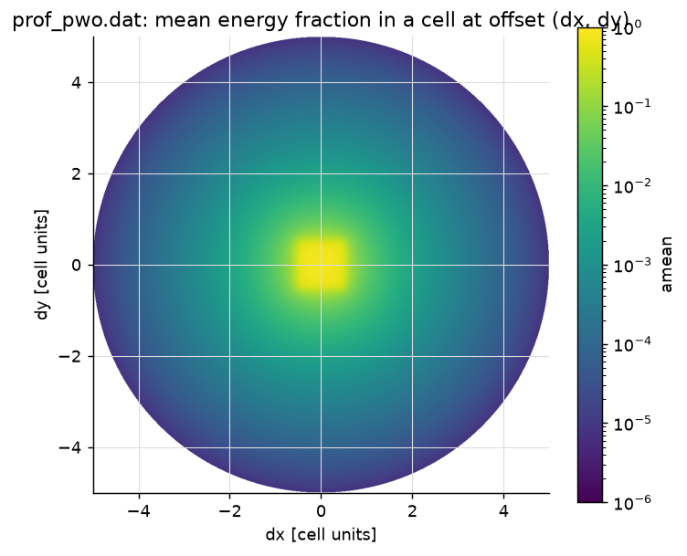
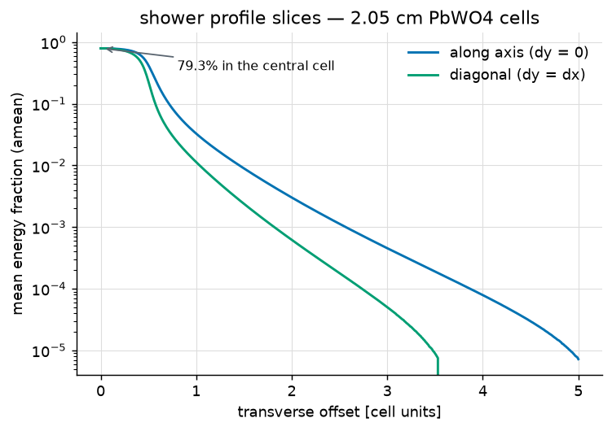
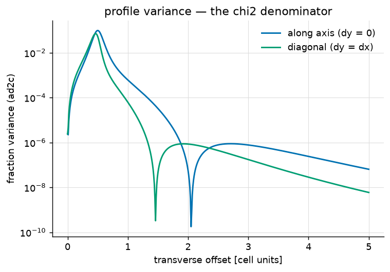

# The shower profile ("weights") file

The `.dat` file given to the config is the **transverse shower profile** of
your calorimeter. Energy sharing between overlapping showers, the
containment correction, and the χ² position fit are all computed against
it.

## What it contains

For a shower axis at transverse offset `(dx, dy)` from a cell center (in
**cell units**), the table gives the *mean fraction* of the shower's energy
deposited in that cell (`amean`), and the *variance* of that fraction
(`ad2c`, the χ² denominator).



`prof_pwo.dat` says: a centered shower puts 79.3% of its energy in its own
2.05 cm PbWO4 cell, 3.3% in each side neighbor, 1.1% in a diagonal one —
falling six orders of magnitude within five cells:



The variance column drives how strongly each cell's deviation from the
expected fraction counts in the χ²:



## File format

Text, one line per node:

```
i  j  amean  ad2c
```

- `i, j` = 100 × |dx|, 100 × |dy| — offsets in units of 0.01 cell, from 0
  to 500 (up to 5.00 cells); only the triangle `j <= i` is stored, the
  symmetric part is mirrored on load; the library bilinear-interpolates
  between nodes. 125,751 lines total.
- `amean` = mean energy fraction in the cell at that offset.
- `ad2c` = variance of that fraction.

## When to generate your own

The offsets are in *cell units*, so the table encodes the ratio of cell
size to the Molière radius, the material, and the longitudinal averaging of
the setup it was made for. Regenerate when any of these changes:

- different **cell size / pitch** relative to the Molière radius (the
  shipped `prof_pwo.dat` is for 2.05 cm PbWO4 cells, `prof_lg.dat` for
  lead glass) — even the same material with a different crystal width
  needs a new table;
- different **material** (X₀, R_M);
- significantly different **incidence geometry** (large angles, very
  different target distance, thick upstream material);
- a response chain that reshapes the *measured* lateral profile — the
  table should describe reconstructed cell energies, not bare deposits.

Symptoms of a wrong profile: energy resolution far off expectations,
biased positions with a strong S-shape, χ² inflated for perfectly clean
single showers.

## How to generate one

Monte-Carlo recipe (data-driven works the same way if you can select clean
single showers with known impact):

1. Simulate single electrons/photons over your energy range, impact points
   uniform across one cell, normal incidence (or your real geometry);
   apply your full response chain to get per-cell *measured* energies.
2. For every event and every cell within 5 cells of the true impact,
   compute the offset `(|dx|, |dy|)` in cell units and the cell's fraction
   of the event's total measured energy — **including zero-signal cells**
   (omitting them biases the tails).
3. Accumulate mean and variance of the fraction in 0.01-cell offset bins;
   symmetrize, smooth thin bins.
4. Write the `j <= i` triangle in the format above.

This recipe was validated end-to-end: a table generated from an
independent Geant4 simulation reproduces the shipped `prof_pwo.dat` within
a few percent in the core, gives identical energy resolution, and —
because it is self-consistent with that simulation's response — even
improves position resolution by 15–20% on the simulated data.
