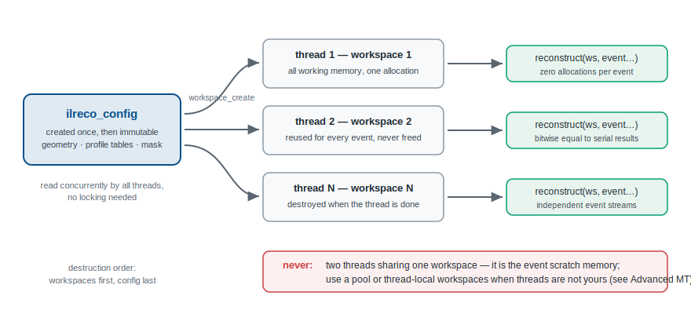

# Threading model

**One shared `const` config, one workspace per thread.**



```c
ilreco_config *cfg = ilreco_config_create(...);   /* main thread, once */

/* in each worker thread: */
ilreco_workspace *ws = ilreco_workspace_create(cfg);
for (;;) { /* ... ilreco_reconstruct(ws, ...) on this thread's events ... */ }
ilreco_workspace_destroy(ws);
```

The rules, and why each holds:

- **The config is immutable after creation** — any number of threads may
  read it concurrently, no locking needed. Call the `ilreco_config_set_*`
  tuners *before* the first workspace is created, never after.
- **A workspace must never be used by two calls at once** — it is the event
  scratch memory. One per thread, created once, reused for every event; do
  NOT create/destroy per event (creation is a large allocation,
  reconstruction is allocation-free).
- **The config must outlive every workspace created from it** — a workspace
  keeps a reference to its config, which is also why `ilreco_reconstruct`
  needs only the workspace: pairing a workspace with the wrong config is
  impossible even with several calorimeters in one program.

## The guarantee

Parallel reconstruction is not merely safe — it is **exact**. The test
suite reconstructs 200 events on 4 threads with a shared config and
compares every energy and position against the serial reference **bitwise**
(`tests/unit/test_context_api.cpp`, tag `[threads]`). Determinism is part
of the contract, not an accident.

## When threads are not yours

The pattern above assumes you control the worker threads. In frameworks
that don't promise which thread calls you (thread pools, task schedulers,
JANA2-style factories), use a workspace pool instead — see
[Advanced multithreading](./advanced-mt). The
[Python binding](./python-api) does exactly that internally.
